  

### 👋 About me

- 🔭 Building **Solutions** with .NET 10, Clean Architecture, DDD and CQRS
- 🌱 Exploring Azure, Kubernetes (AKS) and distributed systems
- 💬 Ask me about Clean Architecture, DDD, CQRS, EF Core and microservices
- 📚 Interested in REST API design: resource naming, status codes, Problem Details, versioning

---

### 🛠️ Tech stack

#### 🧩 Architecture & patterns

#### 📦 Libraries & tooling

### 📊 GitHub stats

  
  

  

